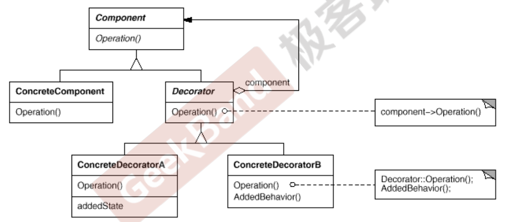
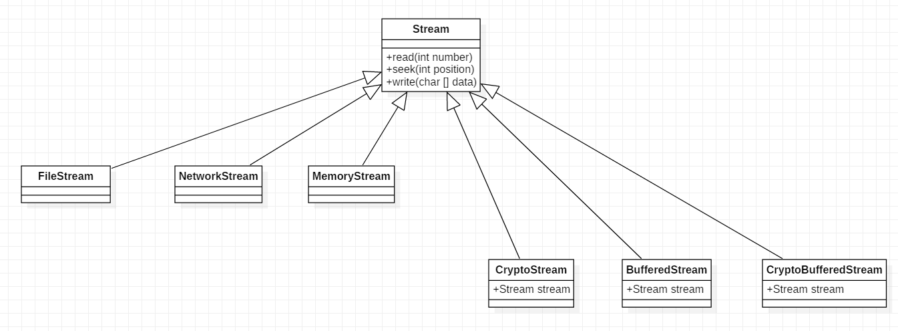
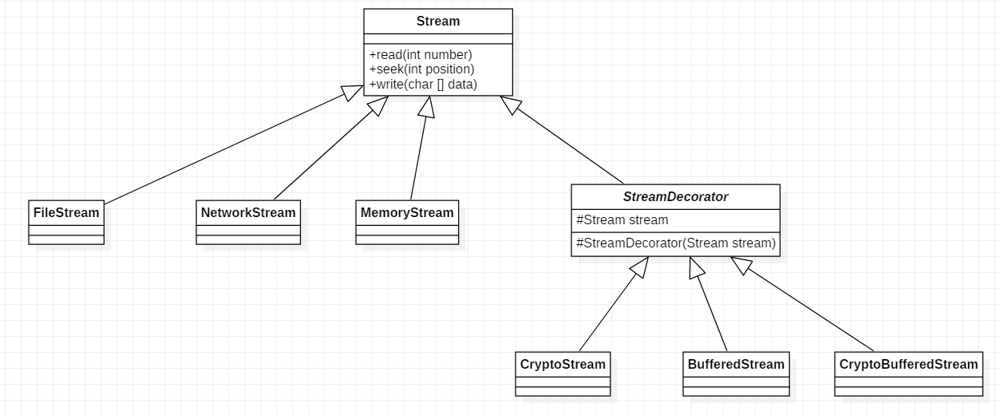
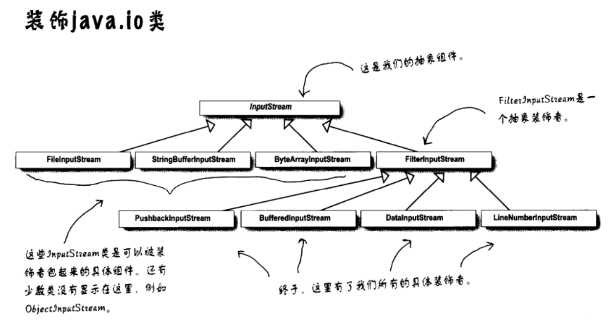

## Chapter 6 Decorator
> **单一职责**  
> 在软件组件的设计中，如果责任划分的不清晰，使用继承得到的结果往往是随着需求的变化，子类急剧膨胀，同时充斥着重复代码，这时候的关键是划清责任。
> 典型模式:  
> • Decorator  
> • Bridge   

### 6.1 Motivation
* 在某些情况下我们可能会“过度地使用继承来扩展对象的功能”，由于**继承为类型引入的静态特质，使得这种扩展方式缺乏灵活性；并且随着子类的增多（扩展功能的增多），各种子类的组合（扩展功能的组合）会导致更多子类的膨胀**。
* 如何使“对象功能的扩展”能够根据需要来动态地实现？同时避免“扩展功能的增多”带来的子类膨胀问题？从而使得任何“功能
扩展变化”所导致的影响降为最低？

### 6.2 Definition
> 动态（组合）地给一个对象增加一些额外的职责。就增加功能而言，Decorator模式比生成子类（继承）更为灵活（消除重复代码 & 减少子类个数）。 —— 《设计模式》 GoF


### 6.3 Structure
  


### 6.4 Course points
* 通过采用组合而非继承的手法，**Decorator模式实现了在运行时动态扩展对象功能的能力，而且可以根据需要扩展多个功能。避免了使用继承带来的“灵活性差”和“多子类衍生问题**”
  <br>
* **Decorator类在接口上表现为is-a Component的继承关系**，即 Decorator类继承了Component类所具有的接口。但**在实现上又表现为has-a Component的组合关系**，即Decorator类又使用了另外一个Component类。
  <br>
* **Decorator模式的目的并非解决“多子类衍生的多继承”问题， Decorator模式应用的要点在于解决“主体类在多个方向上的扩展功能”——是为“装饰”的含义**（主体操作和扩展操作（Decorator）要分开继承）


### 6.5 Example  
#### 6.6.1 案例描述
> 设计实现一个读取文件的流（Stream），暂时需要实现FileInputStream、NetworkStream、MemoryStream这三个主体类，分别用于处理文件流、网络流、内存流，该设计还应该具有对这些不同类别的流内容进行加密、缓存、加密同时缓存的功能。


#### 6.6.2 before
* 最开始的设计：无论是主体类（FileInputStream、NetworkStream、MemoryStream）还是其扩展类（CrytoFileStream...）都是采用继承的方式实现，代码冗余非常严重，并且这种设计思路会导致“类爆炸”。  
    <br>  

* 类图  
    <br>   

        

    <br>   

* 核心逻辑      
    <br>

    ```java
        /**
            * 定义抽象基类
            */
        public abstract class Stream {
            public abstract int read(int number); // 读一些字节，返回下一byte位置，或者-1（如果文件末尾）
            public abstract void seek(int position); // 设置指针到position
            public abstract void write(char []data);
        }

        /**
            * 扩展操作：对主体类 FileStrem 的扩展操作
            * 包括 CryptoFileStream、BufferedFileStream、CryptoBufferedFileStream
            * 以CryptoFileStream 继承 FileInputStream、NetworkStream、MemoryStream为例：
            */
        class CryptoFileStream extends FileStream{
            // 重新方法
        }

        class CryptoNetworkStream extends NetworkStream{
            // 重写方法
        }
        class CryptoBufferedFileStream extends MemoryStream{
            //重写方法
        }


        以加密方法为例：在 FileInputStream、NetworkStream、MemoryStream，中对read()读取的内容所采取的加密
        方法是一样的，但是这种设计方法会产生三个加密类CryptoFileStream、CryptoNetworkStream、CryptoMemoryStream。
        同理Bufferd方法和CryptoBufferd方法都需要分别实现三个类，更夸张的是，如果主体类增多，这些扩展方法的会按照
        阶乘速度增加。
    ```  
* 类 UML 图  


  

#### 6.6.3 middle   

* 通过组合，而不是继承方式来实现,给CryptoFileStream 传入FileInputStream 的引用，这样就可以不继承FileInputStream便可以使用其方法（同样可以传递 NetworkStream、MemoryStream 的引用到CryptoFileStream 中）    

    <br>

    ```java
        /**
        * CryptoFileStream为例：
        */

        class {
            FileInputStream stream; // 关键点：

            public int read(int number){
                stream.read(number);
            }
            // 其他方法
        }

        class CryptoFileStream{
            NetworkStream stream;
            public int read(int number){
                stream.read(number);
            }
            // 其他方法
        }
        class CryptoBufferedFileStream{
            MemoryStream stream;
            public int read(int number){
                stream.read(number);
            }
            // 其他方法
        }
            
    ```
* FileInputStream、NetworkStream、MemoryStream都是继承自 Stream。可以发现上面的唯一不同点在于，声明的stream类型不同，但是联想到多态，我们可以把上面代码统一成如下  

    <br>  

    ```java
            class CryptoFileStream{
                Stream stream; // = new FileInputStream();
                public int read(int number){
                    //额外的加密操作...
                    stream.read(number);
                    //额外的加密操作...
                }
                // 其他方法
            }

            class CryptoNetworkStream{
                Stream stream; // = new CryptoNetworkStream();
                public int read(int number){
                    //额外的加密操作...
                    stream.read(number);
                    //额外的加密操作...
                }
                // 其他方法
            }
            class CryptoBufferedFileStream{
                Stream stream; // = new CryptoBufferedFileStream();
                public int read(int number){
                    //额外的加密操作...
                    stream.read(number);
                    //额外的加密操作...
                }
                // 其他方法
            }
    ```

* 类 UML 图  


  

* 现在，上面三个类的操作可以用一个CryptoStream 完成 ，（Bufferd、CrytoBuffered类似处理）
  > CryptoStream、BufferedStream、CryptoBufferedStream 有个非常特别的共同点：每个类都有一个和父类相同类型(Stream)的变量(Stream)

    ```java
        class CryptoStream extends Stream{
            Stream stream; 
            public CryptoStream(Stream stream){
                this.stream = stream;
            }

            @Override
            public int read(int number){
                //额外的加密操作...
                stream.read(number);
                // 其他操作
            } 

            @Override
            public void seek(int position) {
                //额外的加密操作...
                stream.seek(position);
            }

            @Override
            public void write(char[] data) {
                //额外的加密操作...
                stream.write(data);
            }
        }
    ```
<br>

#### 6.5.4 after  

* 当多个类有相同字段时，应该把该字段往上提（共同继承子另一个类）， CryptoStream、BufferedStream、CryptoBufferedStream 都有Stream stream字段，因此我们对middle进行改进：定义一个抽象类StreamDecorator 作为Decorator 共用变量和方法的统一“接口”。

    ```java
        /**
        * 定义StreamDecorator 抽象类，继承自 Stream
        * 内部也可以定义 Decorator 通用的抽象方法
        */
        abstract class StreamDecorator extends Stream{
            protected Stream stream;

            public StreamDecorator(Stream stream) {
                this.stream = stream;
            }
            // 定义其他通用Decorator 方法
        //    public abstract void otherMethod();
        }
    ```
* CryptoStream、BufferedStream、CryptoBufferedStream等ConcreteDecorator(具体装饰器)都继承自StreamDecorator（抽象装饰器）
    ```java
        class CryptoStream extends StreamDecorator{
            public CryptoStream(Stream stream) {
                super(stream);
            }

            @Override
            public int read(int number) {
                // 额外的加密操作
                return stream.read(number);
            }

            @Override
            public void seek(int position) {
                //额外的加密操作...
                stream.seek(position);
            }

            @Override
            public void write(char[] data) {
                //额外的加密操作...
                stream.write(data);
            }
        }
    ```  

* 运行时绑定（有没有中java _InputStream_ 嵌套的感觉，没错Java IO 使用的正是 _Decorator_ 模式）  


    ```java
        public class Main {
            /**
            * 运行时绑定，灵活
            */
            FileStream fs1 = new FileStream();
            CryptoStream fs2 = new CryptoStream(fs1);
            BufferedStream fs3 = new BufferedStream(fs2);
            CryptoBufferedStream fs4 = new CryptoBufferedStream(fs3);
        }
    ```  
* 类 UML 图  

    

#### 6.6 Java IO Decorator
* Java IO 源码中的装饰器模式  
    
    


#### 6.7 Reference
* [Java 抽象类可以有构造参数吗？](https://blog.csdn.net/JW614718/article/details/88410215)