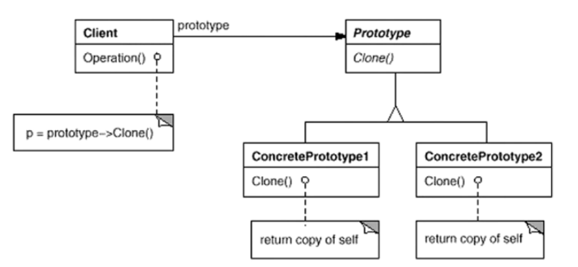
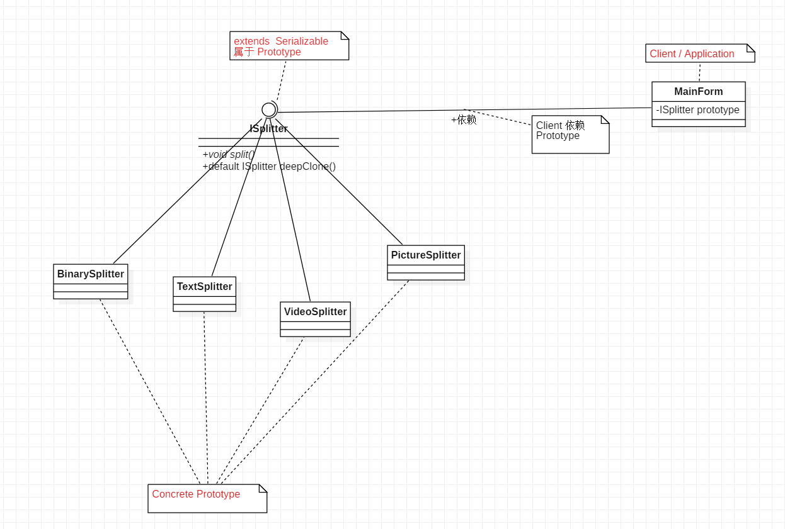

[TOC]

## Chapter 10 Prototype
> **对象创建模式**  
> 通过“对象创建” 模式绕开new，来避免对象创建（new）过程中所导致的紧耦合（依赖具体类），从而支持对象创建的稳定。它是接口抽象之后的第一步工作。
> Prototype 相比较Factory Method 和 Abstract Factory 用的比较少    
> 典型模式    
> • Factory Method  
> • Abstract Factory  
> • **Prototype**  
> • Builder  

### 10.1 Motivation
* 在软件系统中，经常面临着“**某些结构复杂的对象**”的创建工作；由于需求的变化。这些对象经常面临着剧烈的变化，但是他们却拥有比较稳定一致的接口。
  > 和 Factory Method 区别在于，对于复杂对象，可以直接获得当前的状态（复杂），然后在此基础上修。而Factory Method 每次都需要从0重新定义实现到达最终需要的状态。

 <br>
  
* 如何应对这种变化？如何向“客户程序（使用这些对象的程序）”隔离出“这些易变的对象”，从而使得“依赖这些易变对象的客户程序”不随着需求变化而改变？


### 10.2 Definition
> 使用原型实例指定创建对象的种类，然后通过拷贝这些原型来创建新的对象。 ——《设计模式》GoF


### 10.3 Structure

 


### 10.4 Course points
* Prototype 模式同样用于隔离类对象的使用者和具体类型（易变类）直接的耦合关系，它同样要求这些“易变类”拥有“稳定的接口”。

    <br>
    
* Prototype 模式对于“如何创建易变类的实体对象” 采用 “原型克隆”的方法来做，它使得我们可以非常灵活地动态创建“拥有某些稳定接口”的新对象——所需工作仅仅是注册一个新类的对象（即原型），然后在任何需要的地方Clone。

    <br>

* Prototype 模式中的Clone 方法可以利用某些框架中的序列化来实现深拷贝。


### 10.5 Example
#### 10.5.1 案例描述
* 参考 Chapter 8 Factory Method 案例描述

#### 10.5.2 before
* 参考 Chapter 8 Factory Method before

#### 10.5.3 after
* 去除了Factory，采用深复制的方式返回当前状态的Splitter, 核心在于deepClone()

    <br>

    ```java
        /**
        * 因为MainForm需要实例化 ISplitter 必须使用接口实现
        */
        interface ISplitter extends Serializable{
            void split();

            // 使用 Java 8 的 default 方法，减少子类代码冗余
            default ISplitter deepClone() throws IOException, ClassNotFoundException {
                // 序列化
                ByteArrayOutputStream bos = new ByteArrayOutputStream();
                ObjectOutputStream oos = new ObjectOutputStream(bos);

                oos.writeObject(this);

                // 反序列化
                ByteArrayInputStream bis = new ByteArrayInputStream(bos.toByteArray());
                ObjectInputStream ois = new ObjectInputStream(bis);
                return (ISplitter) ois.readObject();
            }
        }
    ```
* 子类 （BinarySplitter、TextSplitter、PictureSplitter、VideoSplitter）实现 ISplitter 接口，继承了 deepClone() 方法

    <br>

    ```java
        class BinarySplitter implements ISplitter{

            @Override
            public void split() {
                // ...
            }
        }
    ```

* MainForm（Application / Client）部分
    
    <br>

    ```java
        public class MainForm {
            // 声明一个原型对象
            ISplitter prototype;

            // Client / Application 从外部传入一个具体的prototype，可以实 BinarySplitter、TextSplitter 等实例对象
            public MainForm(ISplitter prototype) {
                this.prototype = prototype;
            }

            public void buttonClick(String splitterType) throws IOException, ClassNotFoundException {
                ISplitter iSplitter = prototype.deepClone(); // 深复制获得当前原型对象状态
                iSplitter.split();
                // ...
            }
        }
    ```
* 类 UML 图

    

### 10.6 Java 深拷贝与浅拷贝
* 基本类型（String,Integer,Long等）无论深拷贝，浅拷贝都会复制一份

    <br>
    
* 引用类型（类、接口、枚举、数组）
    * 浅拷贝会复制对象的引用类型
    * 深拷贝会复制一份新数据

    <br>

* 如何实现神拷贝
    * 对象本身以及对象内部的引用类型均需要实现 Serializable 接口
    * 使用序列化和反序列化实现deepClone() 方法

    <br>

    ```java
      public Object deepClone() throws IOException,ClassNotFoundException{
              // 序列化
              ByteArrayOutputStream bos = new ByteArrayOutputStream();
              ObjectOutputStream oos = new ObjectOutputStream(bos);
  
              oos.writeObject(this);
  
              // 反序列化
              ByteArrayInputStream bis = new ByteArrayInputStream(bos.toByteArray());
              ObjectInputStream ois = new ObjectInputStream(bis);
              return ois.readObject();
      }
    ```

### 10.7 Reference 
* [java实现深拷贝](https://blog.csdn.net/forwujinwei/article/details/79915872)
* [Java的深拷贝和浅拷贝](https://www.cnblogs.com/ysocean/p/8482979.html)