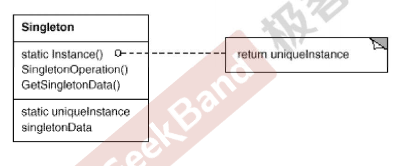

## Chapter 12 Singleton
> **对象性模式**
> 面向对象很好的解决了“抽象”的问题，但是不可避免地要付出一定的代价。对于通常情况来说，面向对象的成本大都可以忽略不计。但是在某些情况，面向对象所带来的成本必须谨慎处理。
> 典型模式    
> • **Singleton**
> • Flyweight

### 10.1 Motivation
* 在软件系统中，经常有这样一些特殊的类，必须保证它们在系统中只存在一个实例，才能确保他们的逻辑正确性、以及良好的效率。

     

* 如何绕过常规的构造器，提供一种机制来保证一个类只有一个实例？

     

* 这应该是类设计者的责任，而不是使用者的责任。

### 10.2 Definition
>**保证一个类仅有一个实例，并且提供一个该实例的全局访问点**。 ——《设计模式》GoF

### 10.3 Structure  

### 10.4 Course points

* Singleton 模式中的实例构造器可以设置为protected以允许子类派生。

     

* Singleton 模式一般不支持Clone,因为这有可能导致多个对象实例，与 Singleton 模式的初衷违背。

* 如何实现多线程环境下安全的 Singleton ?

### 10.5 Example
#### 10.5.1 案例描述
#### 10.5.2 before
#### 10.5.3 after
