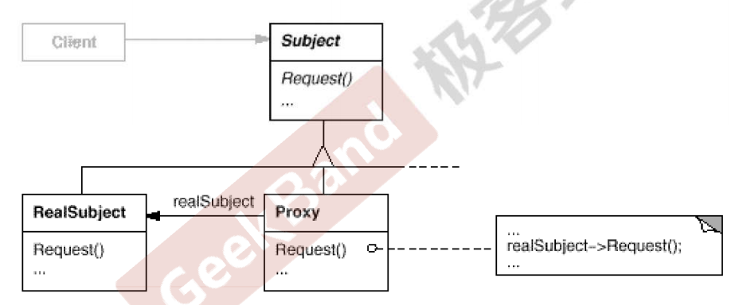

[TOC]

## Chapter 15 Proxy (代理模式)
> **接口隔离模式**   
> 在组件构建过程中，某些接口之间直接的依赖常常会带来很多问题、甚至根本无法实现。采用添加一层**间接**（稳定）接口，来隔离本来互相紧密关联的接口是一种常见的解决方案。   
> 典型模式   
> • Facade   
> • **Proxy**   
> • Adapter   
> • Mediator  

### 15.1 Motivation  
* 在面向对象系统中，有些对象由于某种原因（比如对象创建的开销很大，或者某些操作需要安全控制，或者需要进程外的访问等），直接访问会给使用者、或者系统结构带来很多麻烦。  
  <br>  
* 如何在不失去透明操作对象的同时来管理/控制这些对象特有的复杂性？**增加一层间接层是软件开发中常见的解决方式**。  

### 15.2 Definition  
> 为其他对象提供一种代理以控制（目的：隔离，方法：使用接口）对这个对象的访问。——《设计模式》GoF  

### 15.3 Structure  
  

### 15.4 Course points   
* **“增加一层间接层”是软件系统中对许多复杂问题的一种常见解决方法**。在面向对象系统中，直接使用某些对象会带来很多问题，作为间接层的 Proxy 对象便是解决这一问题的常用手段。  
    <br>  
* 具体 Proxy 设计模式的实现方法、实现粒度都相差很大，有些可能对单个对象做细粒度控制，如copy-on-write技术，有些 可能对组件模块提供抽象代理层，在架构层次对对象做 Proxy。  
    <br>  
* Proxy 并不一定要求保持接口完整的一致性，只要能够实现间接控制，有时候损失一些透明性是可以接受的。  

### 15.5 Application scenarios
* **延迟初始化 （虚拟代理,Virtual Proxy）。如果你有一个偶尔使用的重量级服务对象，一直保持该对象运行会消耗系统资源时，可使用代理模式。**  
  * 你无需在程序启动时就创建该对象，可将对象的初始化延迟到真正有需要的时候。  
    <br>  
* **访问控制（保护代理）。如果你只希望特定客户端使用服务对象，这里的对象可以是操作系统中非常重要的部分，而客户端则是各种已启动的程序（包括恶意程序），此时可使用代理模式**。  
  * 代理可仅在客户端凭据满足要求时将请求传递给服务对象。  
    <br>  
* **本地执行远程服务（远程代理,Remote Proxy）。适用于服务对象位于远程服务器上的情形**。  
  *  在这种情形中，代理通过网络传递客户端请求，负责处理所有与网络相关的复杂细节。  
    <br>  
* **记录日志请求（日志记录代理）。适用于当你需要保存对于服务对象的请求历史记录时。代理可以在向服务传递请求前进行记录。**  
  * 缓存请求结果（缓存代理）。适用于需要缓存客户请求结果并对缓存生命周期进行管理时，特别是当返回结果的体积非常大时。  
  * 代理可对重复请求所需的相同结果进行缓存，还可使用请求参数作为索引缓存的键值。  
    <br>  
* **缓存代理（Caching Proxy），缓存代理会维护之前创建的对象，当收到请求时，在可能的情况下返回缓存对象。**  
  * 为开销大的运算结果提供暂时存储  
  * 允许多个客户共享结果，以减少计算网络延迟  
  <br>  
* **智能引用代理(Smart Reference Proxy)，当主题被引用时，进行额外的动作**  
  * 计算一个对象被引用的次数  
    <br>
  * 可在没有客户端使用某个重量级对象时立即销毁该对象  
    * 代理会将所有获取了指向服务对象或其结果的客户端记录在案。代理会时不时地遍历各个客户端，检查它们是否仍在运行。如果相应的客户端列表为空，代理就会销毁该服务对象，释放底层系统资源  
    * 代理还可以记录客户端是否修改了服务对象。其他客户端还可以复用未修改的对象。  
  <br>
* **防火墙代理**  
  * 控制网络资源的访问，保护主题免于“坏客户”的侵害  

### 15.6 Implements Way  
* 如果没有现成的服务接口，你就需要创建一个接口来实现代理和服务对象的可交换性。从服务类中抽取接口并非总是可行的， 因为你需要对服务的所有客户端进行修改，让它们使用接口。备选计划是将代理作为服务类的子类，这样代理就能继承服务的所有接口了。  
  <br>  
* **创建代理类，其中必须包含一个存储指向服务的引用的成员变量**。**通常情况下**，**代理负责创建服务并对其整个生命周期进行管理。在一些特殊情况下，客户端会通过构造函数将服务传递给代理**。

* 根据需求实现代理方法。在大部分情况下，代理在完成一些任务后应将工作委派给服务对象。  
    <br>
* 可以考虑新建一个构建方法来判断客户端可获取的是代理还是实际服务。你可以在代理类中创建一个简单的静态方法，也可以创建一个完整的工厂方法。  
    <br>
* 可以考虑为服务对象实现延迟初始化。  

### 15.7 Advantages and Disadvantages
#### 15.7.1 Advantages
* 你可以在客户端毫无察觉的情况下控制服务对象。  
  <br>  
* 如果客户端对服务对象的生命周期没有特殊要求， 你可以对生命周期进行管理。  
  <br>  
* 即使服务对象还未准备好或不存在， 代理也可以正常工作。  
  <br>  
* 开闭原则。你可以在不对服务或客户端做出修改的情况下创建新代理。  
  <br>  
#### 15.7.2 Disadvantages
* 代码可能会变得复杂， 因为需要新建许多类  
  <br>  
* 服务响应可能会延迟  

### 15.8 Relationship with other Patterns   
* **适配器模式**能为被封装对象提供不同的接口，**代理模式**能为对象提供相同的接口，**装饰模式**则能为对象提供加强的接。  
  <br>  
* **外观模式**与**代理模式**的相似之处在于它们都缓存了一个复杂实体并自行对其进行初始化。 **代理与其服务对象遵循同一接口**， 使得自己和服务对象可以互换， 在这一点上它与外观不同。  
  <br>  
* **装饰器模式**和**代理模式**有着相似的结构，但是其意图却非常不同。**这两个模式的构建都基于组合原则**，也就是说一个对象应该将部分工作委派给另一个对象。两者之间的不同之处在于**代理通常自行管理其服务对象的生命周期，而装饰的生成则总是由客户端进行控制**，装饰者为对象增加行为，而代理是控制对象的访问。  

<br>  

* **几种看起来的比较像的模式对比**：   
  <br>   
  | 模式      | 描述                             |
  | --------- | -------------------------------- |
  | **Decorator** | 包装另一个对象，并提供额外的行为 |
  | **Facade**    | 包装许多对象以简化它们的接口     |
  | **Proxy**     | 包装另一个对象，并控制对它的访问 |
  | **Adapter**   | 包装另一个对象，并提供不同的接口 |
  | **Mediator**  | 包装另一个对象，处理系统内大量复杂组件间的交互，组件间不直接交流|
  
### 15.9 Example1
#### 15.9.1 案例描述
> 这个例子是课堂上老师给出的一个 Proxy 框架结构  
* 定义主题基类（接口）  
  ```java
    class ISubject {
        // ...
        public void process(){

        }
    }
  ```  
* 通过继承 ISubject 得到一个具体的主题类  
  ```java
    class RealSubject extends ISubject {
        @Override
        public void process() {
            //...
        }
    }
  ``` 
#### 15.9.2 before  
* Client 直接使用 RealSubject  
  ```java  
    /**
      * 这种方式 直接使用 RealSubject 对象，不安全
      */
      class ClientApp{
          ISubject iSubject;

          public ClientApp() {
              iSubject = new RealSubject(); // 这里为了突出Proxy，没有使用工厂方法等运行时编译
          }

          public void doTask(){
              // ...
              iSubject.process();
              // ...
          }
      }
  ```
#### 15.9.3 after  
* 定义委托对象 
  ```java
    public class SubjectProxy extends ISubject{

        public void process() {
            // ...
        }
    }
  ```
* Client 通过 SubjectProxy 委托使用 RealSubject  
  ```java
    /**
      * 这种方式 通过 SubjectProxy 间接使用RealSubject
      * 可以在 SubjectProxy 中进行访问控制，决定是否有权限对 RealSubject
      * 或者以何种方式访问RealSubject
      */
      class ClientApp{
          ISubject iSubject;

          public ClientApp() {
              // 通过代理对象来委托使用RealSubject
              iSubject = new SubjectProxy();
          }

          public void doTask(){
              // ...
              iSubject.process();
              // ...
          }
      }
  ```

### 15.10 Example2  
#### 15.10.1 案例描述  
> 本例演示如何使用代理模式在 Youtube 下载视频， 代码见Proxy/Example2/after） 程序库中添加延迟初始化和缓存。  

#### 15.10.2 after  
* 类图  
    
  <br>  
* 定义 Subject 接口  
  <br>  
  ```java
    // 远程服务接口
    public interface ThirdPartyTVLib {
        List<Video> listVideos();
        String getVideoInfo(int id);
        Video downloadVideo(int id);
    }
  ```  
* 定义接口实现类，具体的RealSubject  
  > 程序库提供了视频下载类。但是该类的效率非常低。如果客户端程序多次请求同一视频，程序库会反复下载该视频， 而不会将首次下载的文件缓存下来复用。   
  <br>    

  ```java
    /**
      * 服务连接器的具体实现。该类的方法可以向腾讯视频请求信息。请求速度取决于
      * 用户和腾讯视频的互联网连接情况。如果同时发送大量请求，即使所请求的信息
      * 一模一样，程序的速度依然会减慢。
      */

      public class ThirdPartyTVClass implements ThirdPartyTVLib{
          @Override
          public List<Video> listVideos() {
              // 向腾讯视频发送一个 API 请求。
              return new ArrayList<>();
          }

          @Override
          public String getVideoInfo(int id) {
              // 获取某个视频的元数据。
              Video video = new Video(1,"一部喜剧片");
              return video.getInfo();
          }

          @Override
          public Video downloadVideo(int id) {
              // 从腾讯视频下载一个视频文件。
              return new Video(2,"动作片"); // 假设是从远程下载下来的Video
          }
      }
  ```  
* 定义 Proxy  
  > 代理类实现和原下载器相同的接口，并将所有工作委派给原下载器。不过，代理类会保存所有的文件下载记录，如果程序多次请求同一文件，它会返回缓存的文件。  
  <br>   
  
  ```java
    /**
    * 对应结构图中的 Proxy
    * 细分的化，属于缓存代理
    * 为了节省网络带宽，我们可以将请求结果缓存下来并保存一段时间。但你可能无
    * 法直接将这些代码放入服务类中。比如该类可能是第三方程序库的一部分或其签
    * 名是`final（最终）`。因此我们会在一个实现了服务类接口的新代理类中放入
    * 缓存代码。当代理类接收到真实请求后，才会将其委派给服务对象。
    */
    public class CachedTVClass implements ThirdPartyTVLib  {
        private ThirdPartyTVLib service;
        private List<Video> listCache = new ArrayList<>();
        private Map<Integer,Video> cacheVideo = new HashMap<>();
        private boolean needReset; // 是否刷新缓存，重新下载

        public CachedTVClass(ThirdPartyTVLib service) {
            this.service = service;
            this.needReset = false;
        }

       // 变量初始化
       // ... 

        @Override
        public List<Video> listVideos() {
            if(listCache == null || needReset){
                listCache = service.listVideos();
            }
            return listCache;
        }
        // 其他方法详见源码
    }
  ```  
* 封装为Component，方便融入其他框架或者Client调用  
  <br>  
    ```java
      public class TVManager {
        private ThirdPartyTVLib service;

        public TVManager(ThirdPartyTVLib service) {
            this.service = service;
        }

        public void renderVideoPage(int id){
            String info = service.getVideoInfo(id);
            // 渲染视频页面。
        }
        // ... 其他各种可能使用的方法
    }
  ```  
* 客户端下载视频  
  <br>  
  ```java
    // 程序可在运行时对代理进行配置。
    public class Application {
        public static void main(String[] args) {
            ThirdPartyTVClass realSubject = new ThirdPartyTVClass();
            CachedTVClass subjectProxy = new CachedTVClass(realSubject);
            TVManager manager = new TVManager(subjectProxy);
            manager.renderOnUserInput(1);
        }
    }
  ```
* 类 UML 图  
  

### 15.11 Reference  
* [Proxy](https://refactoringguru.cn/design-patterns/proxy)  
* 《Head First Design Patterns》


