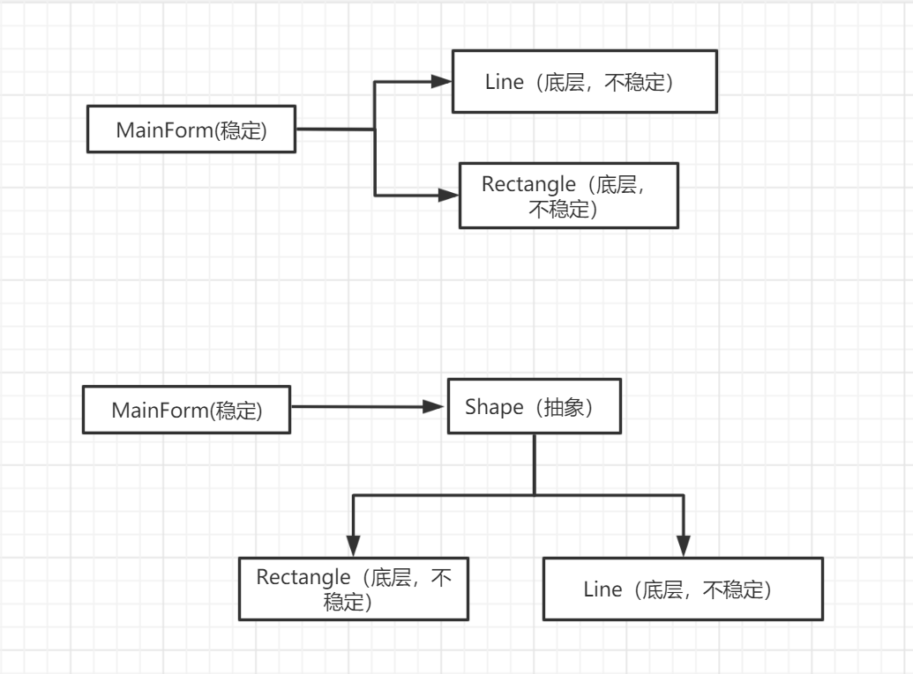

[TOC]

## 第二章 面向对象设计原则

### 2.1 面向对象设计,为什么?
* 变化是复用的天敌 !
* 面向对象设计的最大优势在于**抵御变化**

### 2.2 重新认识面向对象
#### 2.2.1 理解隔离变化
* 从宏观层面来看,面向对象的构建方式更能适应软件的变化,能将变化带来的影响减为最小

#### 2.2.2 各司其职
* 从微观层面看,面向对象的方式更强调各个类的"责任"
* 由于需求变化导致的新增类型不应该影响原来类型的实现——是所谓的各司其职

#### 2.2.3 对象是什么?
* 从语言层面来看,对象封装了代码和数据
* 从规格层面讲,对象是一系列可被使用的公共接口
* 从概念层面讲,对象是某种拥有责任的抽象

### 2.3 面向对象设计原则
> 设计原则往往比设计模式更重要

#### 2.3.1 依赖倒置原则（DIP）
* 高层模块(稳定)不应该依赖于低层模块(变化),二者都应该依赖于抽象(稳定)

* 抽象(稳定)不应该依赖于实现细节(变化),实现细节应该依赖于抽象(稳定)

* Example : 上面为分解方法,下面为抽象方法,可见抽象方法更能适用用户需求变化  
  
  

#### 2.3.2 开放封闭原则（OCP）
* 对扩展开发，对更改封闭
* 类模块应该是可扩展的，但是不可以修改

#### 2.3.3 单一职责原则（SRP）
* 一个类应该仅有一个引起它变化的原因
* 变化的方向隐含着类的责任
  
#### 2.3.4 Liskov 替换原则（LSP）
* 子类必须能够替换他们的基类（IS-A）
* 继承表达类型抽象
  > 所有需要父类的地方，子类都可以传递过去使用

#### 2.3.5 接口隔离原则（ISP）
* 不应该强迫客户程序依赖他们不用的方法
* 接口应该小而完备
  > 不要把不必要的方法public，子类使用则protected，本类使用则private，真正有必要的话才public，因为接口是客户程序所依赖的（要保持稳定）

#### 2.3.6 优先使用对象组合，而不是类继承
* 类继承通常为“白箱复用”，对象组合通常为“黑箱复用”
* 继承在某种程度上破坏了封装性（暴露多），子类父类耦合度高
* 对象组合则只要求被组合的对象具有良好定义的外部接口，耦合度低

#### 2.3.7 封装变化点
* 使用封装来创建对象之间的分界层，让设计者可以在分界层的一侧进行修改，而不会对另一侧产生不良影响，从而实现层次间的松耦合
  > 从底层思维理解，封装是封装代码和数据，从高层次理解是封装变化点，一侧变化，一侧稳定

#### 2.3.8 针对接口编程，而不是针对实现编程
> 和依赖倒置原则相辅相成
* 不将变量类型声明为某个特定的具体类，而是声明为某个接口。
  > 这里的特定具体类不包括Java自带的一些类型如（String,Ingeger），而是自定义的业务类型
* 客户程序无需获知对象的具体类型，只需知道对象所具有的接口
* 减少系统中各部分的依赖关系，从而实现“高内聚、低耦合”的类型设计方案

### 3.1 面向接口设计
* 产业强盛标志：**接口标准化**

#### 3.1.1 以史为鉴（1）
* 秦为什么能够统一六国？
  > 据史书记载，秦的兵器不论东西南北，出土地点都有统一的标准，包括剑，戈，弩，等，而其他六国不是
  > 秦国“面向接口设计的素养”

#### 3.1.1 以史为鉴（2）
* 毕升活字印刷成为四大发明，推动人类文明进步
  > 毕升之前的雕版印刷将字刻死在木板或石板上，每次印刷不同文章，要刻不同的版。而毕升发明的活字印刷首先在板上刻好字格,然后再刻单独的字模。印刷时，将活的字模“按需索取”放在字格中，不同的排列方法产生不同的文章，而不必重新刻版。

### 4.1 将设计原则提升为设计经验
#### 4.1.1 设计习语 Design Idioms
* Design Idioms 描述与特定编程语言相关的低层模式，技巧，惯用法。
  > Example: 《Effective C++》,《More Effective C++》

#### 4.1.2 设计模式 Design Patterns
* Design Patterns主要描述的是“类与相互通信的对象之间的组织关系，包括它们的角色、职责、协作方式等方面。
  > 主要解决变化中的复用性问题

#### 4.1.3 架构模式 Architectural Patterns
* Architectural Patterns描述系统中与基本结构组织关系密切的高层模式，包括子系统划分，职责，以及如何组织它们之间关系的规则。

