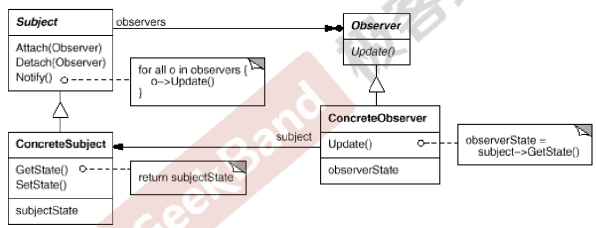
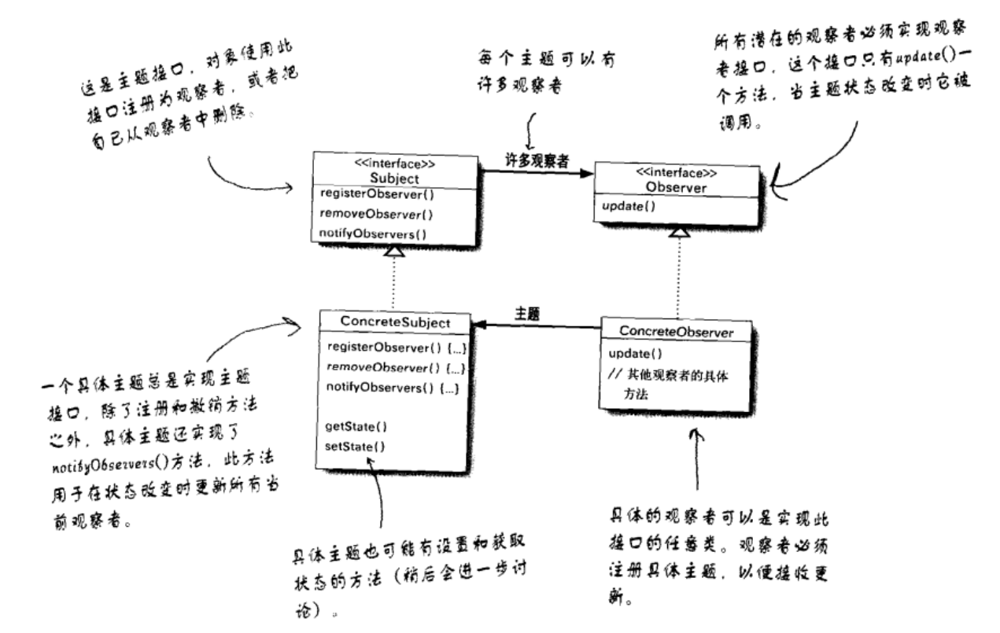
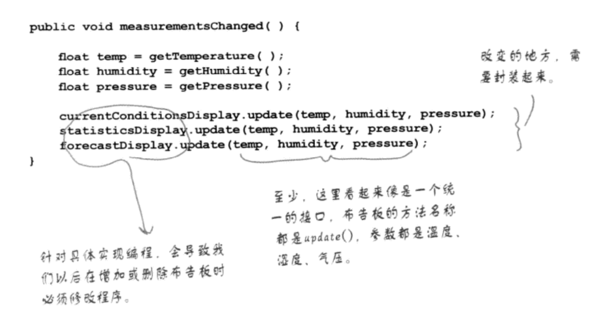
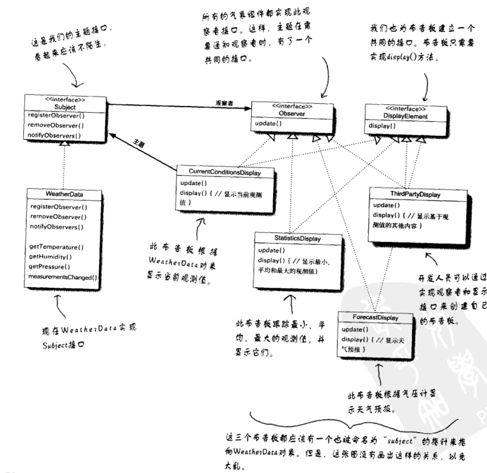
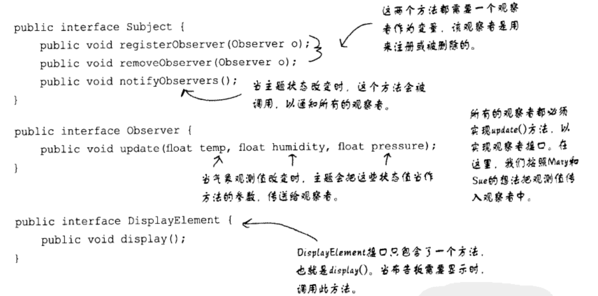

[TOC]

## Chapter 5 Observer

### 5.1 Motivation
* 在软件构建过程中，我们需要为某些对象建立一种“通知依赖关系” ——一个对象（目标对象）的状态发生改变，所有的依赖对象（观察者对象）都将得到通知。如果这样的依赖关系过于紧密，将使软件不能很好地抵御变化
     
* 使用面向对象技术，可以将这种依赖关系弱化，并形成一种稳定的依赖关系。从而实现软件体系结构的松耦合

### 5.2 Definition
> 定义对象间的一种一对多（变化）的依赖关系，以便当一个对象(Subject)的状态发生改变时，所有依赖于它的对象(Observer)都得到通知并自动更新。

### 5.3 Structure
> From《设计模式》GoF  
> 

> From 《Head First Design Patterns》

### 5.4 Course points
* **使用面向对象的抽象，Observer模式使得我们可以独立地改变目标与观察者，从而使二者之间的依赖关系达致松耦合。**
     

* **目标发送通知时，无需指定观察者，通知（可以携带通知信息作为参数）会自动传播。**
     
* **观察者自己决定是否需要订阅通知，目标对象对此一无所知**
     

* **Observer模式是基于事件的UI框架中非常常用的设计模式，也是MVC模式的一个重要组成部分**

### 5.5 Example 
> 例子来自《Head First Design Patterns》的 Observer模式

* **改进前**
  > WeathdeData 依赖具体的xxxDisplay 实现，**破坏了依赖倒置原则** ，如果后续扩展 display pane，则需要修改 WeatherData 代码，这又**破坏了 “开闭原则”**

     
     

* **改进后的类UML图示**

     
     

* **定义 Observer 和 Subject 接口**

### 5.5 Example 
* 可以对Observer update 方法参数再次封装，方便扩展更多的参数，而不仅仅包括 temperature、humidity、pressure这三个参数
     

* Observer 的update 可以传入Subject对象，用于区分更新哪个Subject对象（一个Observer可能订阅多个Subject）